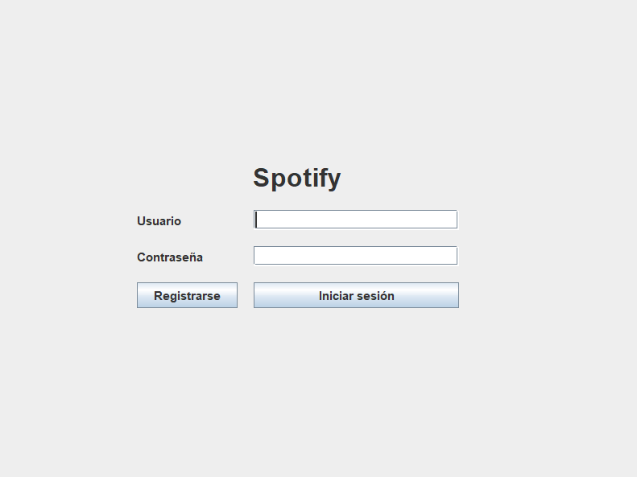
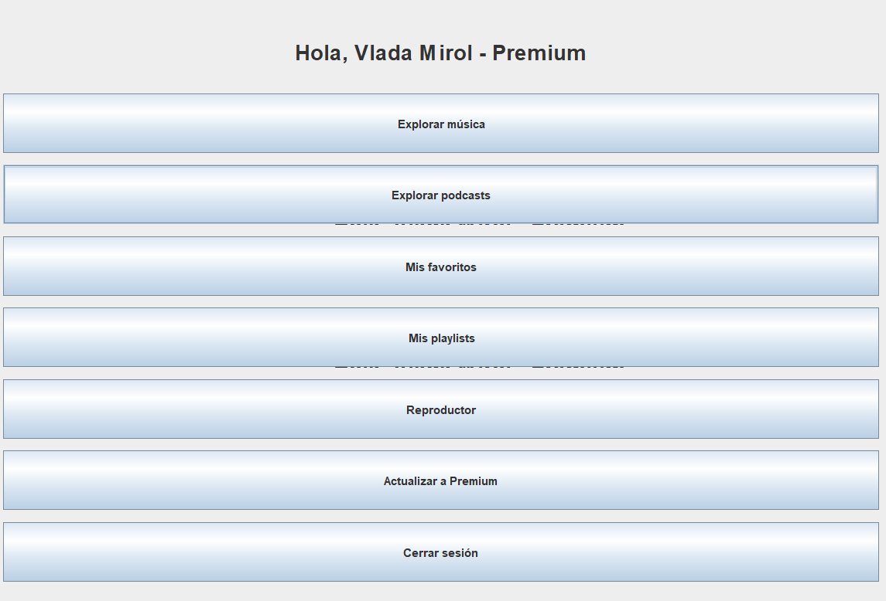
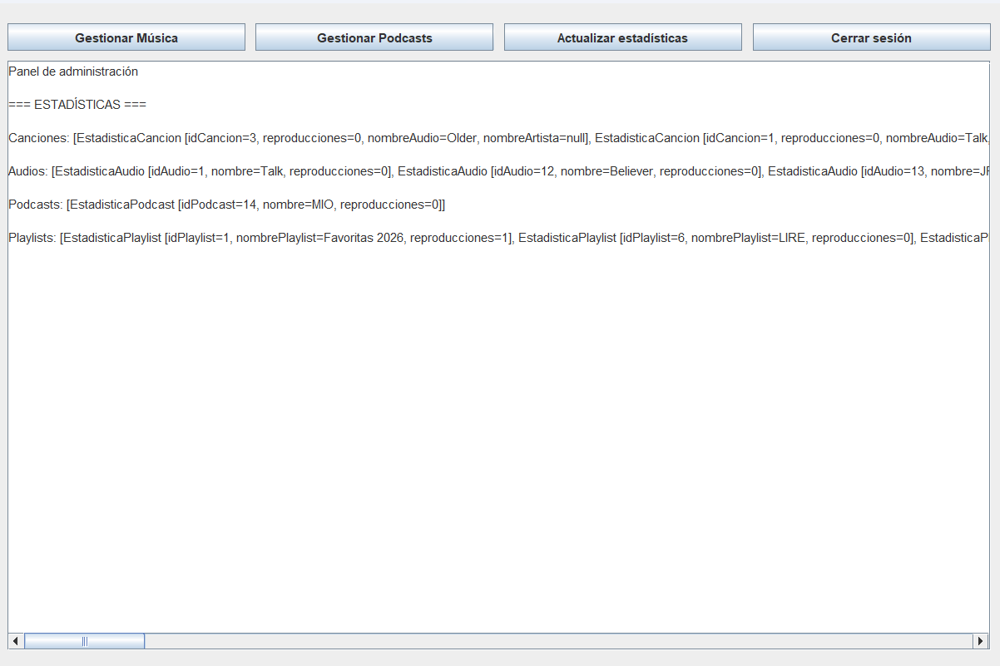
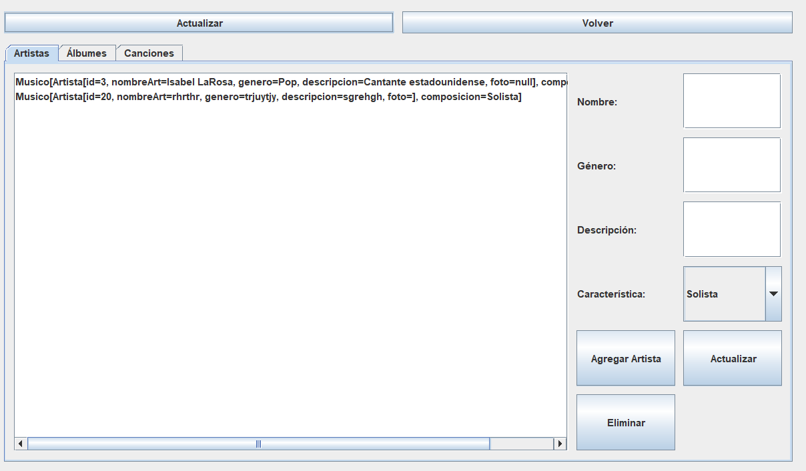
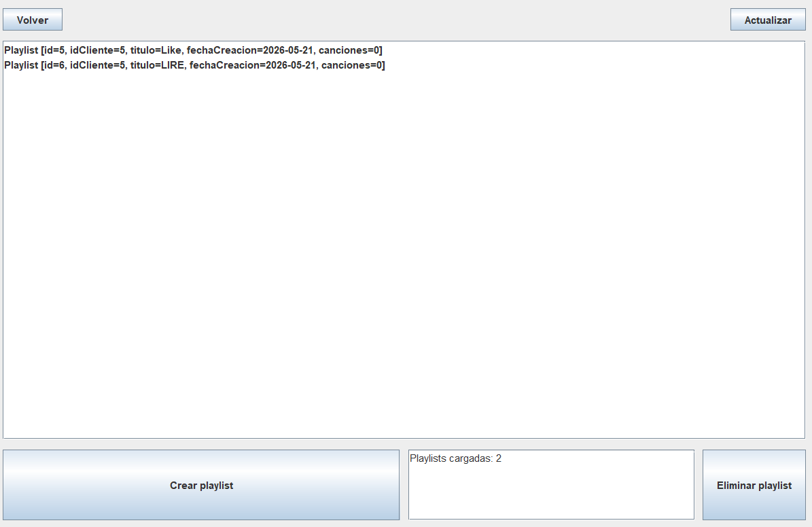
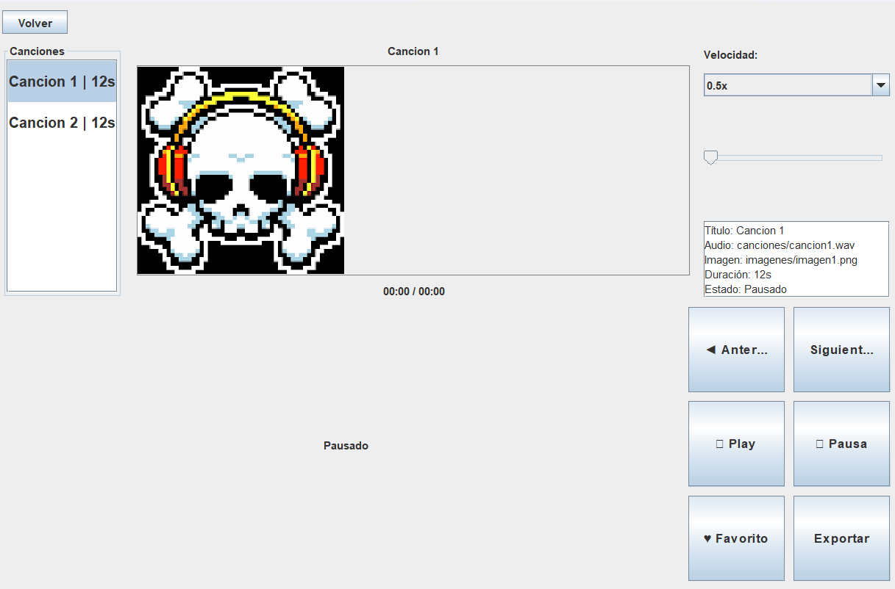

# Spotify

## Опис проєкту

Це навчальний Java-проєкт у стилі музичного сервісу Spotify. Програма реалізує графічний інтерфейс, роботу з користувачами, музикою, подкастами, плейлистами, улюбленими аудіо та адміністративною частиною. Дані зберігаються в базі даних MySQL, а доступ до них виконується через JDBC.

Проєкт побудований як багатошарова архітектура desktop-застосунку:

- **`modelo`** — класи предметної області.
- **`controlador`** — логіка доступу до БД, керування діями користувача та відтворенням.
- **`panel`** — екрани Swing-інтерфейсу.
- **`vista`** — головне вікно та запуск програми.

## Основні можливості

- реєстрація та вхід користувача;
- підтримка типів користувачів **Free** і **Premium**;
- перегляд музики, виконавців і подкастів;
- відтворення аудіо;
- створення, видалення, імпорт та експорт плейлистів;
- додавання треків до плейлистів і до обраного;
- адміністративне керування музикою, подкастами та статистикою;
- обмеження для Free-користувачів;
- відображення статистики прослуховувань.

## Технології

- **Java**
- **Swing** для графічного інтерфейсу
- **JDBC** для роботи з базою даних
- **MySQL** як СУБД
- SQL-скрипт бази: `scriptDB/spoty.sql`

## Структура проєкту

### `src/modelo`

Класи предметної області, які описують дані програми.

- `Audio` — базовий абстрактний клас аудіо-об’єкта.
- `Album` — модель альбому.
- `Artista` — базовий клас виконавця.
- `Cancion` — модель пісні.
- `Cliente` — модель користувача системи.
- `Musico` — музичний виконавець.
- `Playlist` — список відтворення.
- `Podcast` — модель подкасту.
- `Podcaster` — автор подкасту.
- `StastisticaCancion` — статистика пісень.
- `StatisticaAudio` — статистика аудіо.
- `StatisticaPlaylist` — статистика плейлистів.
- `StatisticaPodcast` — статистика подкастів.

### `src/controlador`

Класи керування логікою програми та взаємодією з БД.

- `ControladorDB` — основний клас доступу до бази даних. Містить методи для входу, реєстрації, CRUD-операцій, плейлистів, обраного, статистики та перевірок обмежень Free-користувача.
- `ControladorEntradaYSalida` — допоміжний контролер для вводу/виводу.
- `GestorCliente` — керування логікою клієнта.
- `GestorClienteNuevo` — оновлена логіка керування клієнтом і його діями.
- `Imprimir` — допоміжний клас для виводу інформації.
- `ReproductorAudio` — логіка відтворення аудіо.
- `SimpleAudioPlayer` — простий програвач аудіо.
- `SimpleFileController` — робота з файлами.

### `src/panel`

Графічні панелі для окремих екранів програми.

- `PanelLogin` — вікно входу.
- `PanelRegistro` — вікно реєстрації.
- `PanelMenuCliente` — меню клієнта.
- `PanelMusica` — перегляд музики.
- `PanelPodcasts` — перегляд подкастів.
- `PanelPlaylists` — керування плейлистами.
- `PanelFavoritos` — список улюбленого.
- `PanelReproductor` — екран відтворення.
- `PanelPremium` — екран преміум-можливостей.
- `PanelAdmin` — адміністративна панель.
- `PanelRefrescable` — інтерфейс для панелей, які можуть оновлювати свої дані.

### `src/vista`

- `Launcher` — стартовий клас програми.
- `VentanaPrincipal` — головне вікно, у якому змінюються панелі застосунку.

## Опис ключових класів

### `ControladorDB`

Найважливіший клас проєкту. Виконує:

- підключення до MySQL;
- перевірку логіна і пароля;
- створення користувача;
- завантаження артистів, альбомів, пісень, подкастів і плейлистів;
- створення, оновлення та видалення музичних об’єктів;
- роботу з улюбленими;
- перевірку обмежень для Free-користувачів;
- підрахунок кількості плейлистів;
- збереження інформації про останнє відтворення;
- отримання статистики.

### `Cliente`

Описує користувача системи. Зберігає ім’я, прізвище, логін, пароль, мову, дату народження, тип користувача та ознаку Premium.

### `Audio`

Абстрактний батьківський клас для всіх аудіооб’єктів. Від нього наслідуються `Cancion` і `Podcast`.

### `Cancion`

Описує пісню: назву, файл, тривалість, кількість прослуховувань, альбом і колабораторів.

### `Podcast`

Описує подкаст: назву, файл, тривалість, кількість прослуховувань, автора та кількість учасників.

### `Album`

Містить дані про альбом: назву, рік, жанр, фото та виконавця.

### `Artista`, `Musico`, `Podcaster`

- `Artista` — базовий клас виконавця.
- `Musico` — музичний виконавець із додатковою характеристикою.
- `Podcaster` — автор подкастів.

### `Playlist`

Містить інформацію про плейлист, дату створення, власника та список пісень. Також підтримує додавання, видалення, пошук пісень і підрахунок тривалості.

### `Panel*`

Кожна панель відповідає за окремий екран програми. Разом вони формують інтерфейс для клієнта та адміністратора.

## База даних

Файл структури бази даних знаходиться тут:

- `scriptDB/spoty.sql`

У ньому описані таблиці, зв’язки, представлення та інші об’єкти, які використовуються програмою.

## Тести

У проєкті є окремі юніт-тести для моделей та для логіки доступу до бази даних. Вони знаходяться в папці `src/testear`.

## Фото проєкту

### Вікно входу

### Головне вікно

### Адміністративна панель

### Адміністрування музики

### Плейлисти

### Відтворення

## Запуск

1. Імпортувати проєкт у IDE.
2. Переконатися, що підключена бібліотека MySQL Connector.
3. Створити або імпортувати базу даних з `scriptDB/spoty.sql`.
4. Запустити клас `vista.Launcher`.

## Примітка

Назви деяких класів у проєкті збережені так, як вони вже були реалізовані в коді, навіть якщо містять друкарські помилки в імені. Це зроблено для сумісності з існуючою структурою проєкту.
